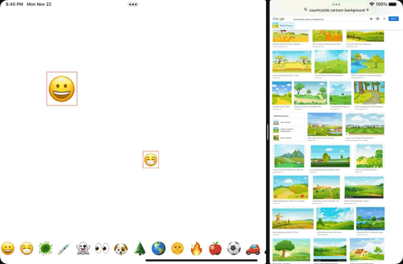
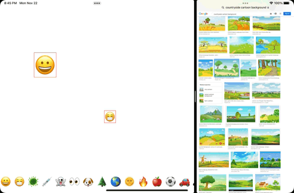
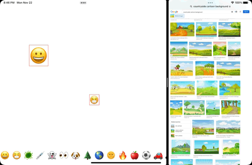

# CS193p-Developing-Apps-for-iOS-2021-Spring
스탠포드 대학교의 [iOS 강의]를 수강한 내용을 정리합니다.

[iOS 강의]: ([http://](https://cs193p.sites.stanford.edu/))

## screenshots
### Assignment #4
애니메이션 시연을 위해 Match case는 무조건 Match가 되도록 했습니다.

### Assignment #5

drag

 

zoom

 

remove

